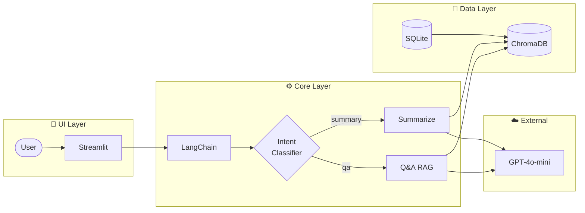

# AI Review Analyst: Smart Buying Decision Agent

> **"리뷰를 읽는 시간 30분을 30초로 단축하다."**
>
> RAG(검색 증강 생성) 기반 이커머스 리뷰 분석 및 구매 의사결정 지원 에이전트


---

## Project Overview

**AI Review Analyst**는 이커머스 플랫폼(올웨이즈, 쿠팡 등)의 방대한 리뷰 데이터를 분석하여, 사용자가 **구매 고민(Hesitation)**을 끝내고 **구매 확신(Conviction)**을 갖도록 돕는 AI 에이전트입니다.

단순한 '3줄 요약'을 넘어, 사용자의 상황(육아, 자취, 특정 취향)에 맞는 정보를 **팩트 기반(Fact-based)**으로 답변하여 **이탈률 감소**와 **구매 전환율(CVR) 증대**를 목표로 합니다.

---

## The Problem (Why I built this)

초저가/발견형 커머스 사용자들은 다음과 같은 **Pain Point**를 겪고 있습니다.

| Problem                  | Description                                                         |
| ------------------------ | ------------------------------------------------------------------- |
| **Information Overload** | 인기 상품의 수천 개 리뷰를 일일이 읽기엔 시간이 부족함              |
| **Trust Issues**         | 광고성 리뷰와 진성 리뷰가 섞여 있어 품질을 확신하기 어려움          |
| **Lack of Context**      | 별점 4.5점이라도, "내 상황(예: 매운 걸 못 먹음)"에 맞는지 판단 불가 |

---

## The Solution

**RAG(Retrieval-Augmented Generation)** 기술을 활용해 비정형 리뷰 데이터를 구조화하고, LLM이 '나만의 쇼핑 비서'처럼 행동합니다.

| Feature              | Description                                                      | Tech Key                             |
| :------------------- | :--------------------------------------------------------------- | :----------------------------------- |
| **쇼핑몰 스타일 UI** | 제품 목록 → 제품 상세 → 리뷰 분석 흐름의 직관적 인터페이스       | `Streamlit`, `UX Design`             |
| **AI 추천 판단**     | 속성별 강점/약점 분석 기반 추천 여부 및 근거 제시                | `Aspect Analysis`, `Reasoning`       |
| **시맨틱 Q&A**       | "이거 3살 아기가 먹어도 돼?" 같은 자연어 질문에 리뷰 근거로 답변 | `RAG`, `Vector DB`                   |
| **속성 추출**        | Raw 리뷰에서 가격/디자인/품질/배송 등 속성별 감정 자동 분석      | `LLM Prompting`, `Structured Output` |
| **가짜 리뷰 필터링** | 의심 리뷰 [의심] 라벨 표시, 신뢰도 기반 가중치 조정              | `Rule-based`, `Classification`       |
| **근거 리뷰 표시**   | AI 답변 시 참고한 리뷰 원문 + 핵심 문구 하이라이트               | `Source Citation`, `Highlighting`    |
| **카카오톡 Q&A**     | 카카오톡 스타일 채팅 UI, 로딩 스피너, 실시간 응답                | `Chat UI`, `Streaming`               |

---

## Tech Stack

| Category          | Technology                                                  |
| ----------------- | ----------------------------------------------------------- |
| **Core Logic**    | Python, LangChain (Orchestration), LangGraph (Flow Control) |
| **AI Model**      | OpenAI GPT-4o-mini (Cost-effective reasoning)               |
| **Vector DB**     | ChromaDB (Vector Store for semantic search)                 |
| **Metadata DB**   | SQLite (Product/Review metadata storage)                    |
| **Data Pipeline** | Playwright (Dynamic crawling), BeautifulSoup                |
| **UI/UX**         | Streamlit (Rapid MVP prototyping)                           |
| **Deployment**    | Docker, AWS EC2                                             |

---

## System Architecture



### Data Flow

1. **Data Source:** AI Hub 속성기반 감정분석 데이터 → SQLite DB 저장
2. **Embedding:** 리뷰 텍스트 벡터화 후 ChromaDB에 저장
3. **Retrieval:** 사용자 질문과 유사한 리뷰 벡터 검색
4. **Generation:** 검색된 리뷰 맥락을 바탕으로 LLM이 답변 + 근거 리뷰 반환

### Data Source

| Source                       | Reviews | Category                     | Status     |
| ---------------------------- | ------- | ---------------------------- | ---------- |
| **AI Hub 속성기반 감정분석** | 180K+   | 패션/화장품/가전/IT/생활용품 | ✅ 활용 중 |

> **Note:** [AI Hub 속성기반 감정분석 데이터](https://aihub.or.kr/aihubdata/data/view.do?dataSetSn=71603)를 SQLite DB에 마이그레이션하여 제품/리뷰 메타데이터를 관리하고, ChromaDB에서 벡터 검색을 수행합니다.

---

## Project Structure

```
ai-review-analyst/
├── README.md
├── docs/
│   ├── PRD.md                 # Product Requirements Document
│   ├── Tasks.md               # 작업 관리 문서
│   ├── TechStack.md           # 기술 스택 문서
│   ├── API.md                 # API 레퍼런스
│   └── UserGuide.md           # 사용자 가이드
├── data/
│   ├── reviews.db             # SQLite 데이터베이스
│   └── chroma_db/             # ChromaDB 벡터 저장소
├── src/
│   ├── __init__.py
│   ├── config.py              # 설정 모듈
│   ├── database.py            # SQLite DB 관리 모듈
│   ├── pipeline/              # Data processing
│   │   ├── aihub_loader.py    # AI Hub 데이터 로더
│   │   ├── aspect_extractor.py # LLM 속성 추출기
│   │   ├── fake_review_filter.py # 가짜 리뷰 필터
│   │   ├── preprocessor.py
│   │   └── embedder.py
│   ├── prompts/               # 프롬프트 템플릿
│   │   └── templates.py       # Q&A, 요약, 감성분석 프롬프트
│   ├── agents/                # LangGraph agents
│   │   ├── state.py           # AgentState 정의
│   │   ├── intent_classifier.py # 의도 분류기
│   │   ├── summarize_agent.py
│   │   ├── qa_agent.py
│   │   └── graph.py           # StateGraph 구성
│   ├── chains/                # LangChain chains
│   │   └── rag_chain.py
│   ├── core/                  # 공통 모듈
│   │   ├── logging.py         # 로깅 설정
│   │   └── exceptions.py      # 커스텀 예외
│   └── ui/
│       └── app.py             # Streamlit 대시보드
├── tests/                     # pytest 테스트 (256개)
├── app.py                     # Streamlit 엔트리포인트
├── requirements.txt
└── .env.example
```

---

## Getting Started

### Prerequisites

- Python 3.9+
- OpenAI API Key

### Installation

```bash
# 1. Clone the repository
git clone https://github.com/sammy0329/ai-review-analyst.git
cd ai-review-analyst

# 2. Create virtual environment
python -m venv venv
source venv/bin/activate  # On Windows: venv\Scripts\activate

# 3. Install dependencies
pip install -r requirements.txt

# 4. Install Playwright browsers
playwright install chromium

# 5. Set up environment variables
cp .env.example .env
# Edit .env and add your OPENAI_API_KEY
```

### Running the Application

```bash
# Run Streamlit app (쇼핑몰 스타일 UI)
streamlit run src/ui/app.py

# 또는 루트의 엔트리포인트 사용
streamlit run app.py
```

---

## Key Features Demo

### 1. Product Explorer (쇼핑몰 스타일 UI)

```
[제품 목록 화면]
┌─────────────┐ ┌─────────────┐ ┌─────────────┐
│ 제품 A      │ │ 제품 B      │ │ 제품 C      │
│ ⭐ 4.2/5.0  │ │ ⭐ 3.8/5.0  │ │ ⭐ 4.5/5.0  │
│ 리뷰 128개  │ │ 리뷰 89개   │ │ 리뷰 256개  │
│ 👍 추천     │ │ 🤔 괜찮음   │ │ 👍 추천     │
└─────────────┘ └─────────────┘ └─────────────┘

[제품 상세 화면]
- 📋 한눈에 보기: 평점, 리뷰 수, AI 추천 판단 (강점/약점 근거)
- ✏️ 리뷰 작성: 사용자 리뷰 추가, LLM 속성 분석
- 💬 AI Q&A: 카카오톡 스타일 채팅, 근거 리뷰 하이라이트
- 🏷️ 속성별 리뷰: 속성별 감정 통계, 리뷰 원문 + 하이라이트
- 📋 전체 리뷰: 최신순, 감정별 색상, [의심] 라벨
```

### 2. AI 추천 판단 (Recommendation)

```
[제품 상세 페이지]
┌────────────────────────────────────────┐
│ 👍 추천해요!                           │
│                                        │
│ ✅ 배송 만족도 높음 (85%)              │
│ ✅ 품질 만족도 높음 (78%)              │
│                                        │
│ ⚠️ 참고: 가격 불만 있음 (42%)          │
└────────────────────────────────────────┘

→ 속성별 강점/약점 분석 기반 추천 판단
→ 구체적인 수치와 근거 제시
```

### 3. 카카오톡 스타일 Q&A

```
[💬 AI Q&A 채팅]
┌────────────────────────────────────────┐
│ 👤 "이거 3살 아기가 먹어도 괜찮아?"    │
│                                        │
│ 🤖 리뷰 분석중 ⟳                       │
│                                        │
│ 🤖 "12개의 리뷰에서 '아이' 관련 언급을 │
│    찾았습니다. 8개 리뷰가 긍정적..."   │
│    📚 근거 리뷰 (12개)                 │
└────────────────────────────────────────┘

→ 근거 리뷰 클릭 시 원문 + 핵심 문구 하이라이트
→ 의심 리뷰 [의심] 라벨 표시
```

### 4. 가짜 리뷰 필터링

```
[전체 리뷰 목록]
┌────────────────────────────────────────┐
│ ⭐ 5 | 긍정                            │
│ "정말 좋은 제품이에요! 배송도 빠르고..."│
├────────────────────────────────────────┤
│ ⭐ 5 | 긍정 | [의심]                   │
│ "최고최고 인생템 무조건 사세요!!"      │
│ ⚠️ 의심 사유: 과도한 칭찬              │
└────────────────────────────────────────┘

→ 규칙 기반 의심 리뷰 탐지
→ 대표 리뷰 선정 시 의심 리뷰 제외
```

---

## Development Roadmap

### Phase 1: Foundation (100% 완료)

- [x] Project setup & documentation
- [x] Playwright crawler implementation (봇 탐지로 제한적)
- [x] AI Hub 공개 데이터셋 통합 (225K+ 이커머스 리뷰)
- [x] Data preprocessing pipeline

### Phase 2: Core RAG (100% 완료)

- [x] ChromaDB integration & embedding pipeline
- [x] LangChain RAG chain
- [x] Prompt engineering (Q&A, 요약, 감성분석)
- [x] LLM 기반 속성 추출 시스템 (27개 테스트 통과)

### Phase 3: Agent System (100% 완료)

- [x] LangGraph 기반 멀티 에이전트 아키텍처
- [x] Intent Classifier (의도 분류: QA/요약)
- [x] Q&A Agent, Summarize Agent
- [x] 가짜 리뷰 필터링 시스템

### Phase 4: Dashboard & UI (100% 완료)

- [x] 기본 Streamlit 대시보드
- [x] 쇼핑몰 스타일 UI 개편 (제품 목록 → 상세 → Q&A)
- [x] 제품별 RAG Q&A 기능
- [x] 카테고리 대분류/소분류 계층 필터

### Phase 5: Deployment (100% 완료)

- [x] Docker 컨테이너화
- [x] AWS EC2 배포
- [x] 테스트 커버리지 44% 달성 (256개 테스트)

### Phase 6: Testing & Documentation (100% 완료)

- [x] pytest 기반 단위 테스트 (256개)
- [x] 테스트 커버리지 44%
- [x] PRD, TechStack, API, UserGuide 문서 작성

### Phase 7: Consumer Review UX (100% 완료)

- [x] 제품 상세 페이지 개편 (추천 판단, 속성별 리뷰)
- [x] 리뷰 신뢰도 표시 (가짜 리뷰 [의심] 라벨)
- [x] Q&A 채팅 UX 개선 (카카오톡 스타일, 로딩 스피너)
- [x] 핵심 문구 하이라이트 (AI 응답 기반)
- [x] 리뷰 날짜 임의화 (실제 서비스 느낌)

---

## Target Position

이 프로젝트는 [레브잇 Problem Solver AI Agent 인턴](https://www.wanted.co.kr/wd/308575) 포지션 지원을 위해 개발되었습니다.

### Demonstrated Skills

| Skill                  | Implementation                               |
| ---------------------- | -------------------------------------------- |
| **LLM/RAG**            | LangChain + ChromaDB 기반 검색 증강 생성     |
| **Agent Development**  | LangGraph를 활용한 멀티 에이전트 시스템      |
| **Prompt Engineering** | 팩트 기반 요약 및 출처 명시 프롬프트 설계    |
| **Web Crawling**       | Playwright + Stealth 기반 동적 페이지 크롤링 |
| **Data Pipeline**      | HuggingFace 데이터셋 통합 및 벡터 임베딩     |
| **Problem Solving**    | 크롤링 한계 → 공개 데이터셋 활용 전략 수립   |
| **Rapid Prototyping**  | Streamlit MVP 개발                           |

---

## Documentation

- [PRD (Product Requirements Document)](./docs/PRD.md)
- [Tech Stack (기술 스택 상세)](./docs/TechStack.md)
- [Tasks (작업 관리)](./docs/Tasks.md)

---

## License

This project is licensed under the MIT License - see the [LICENSE](LICENSE) file for details.

---

_Built with passion for AI-powered problem solving_
