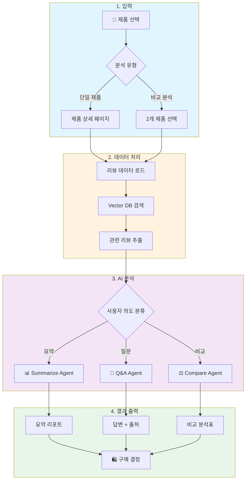
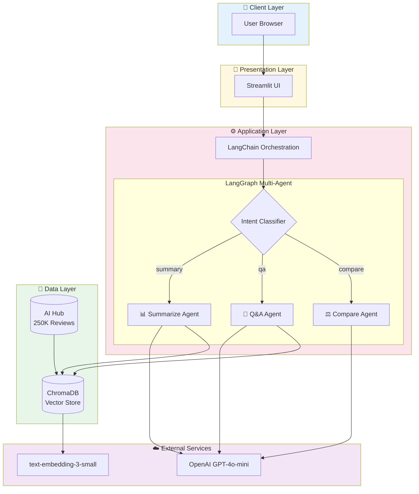
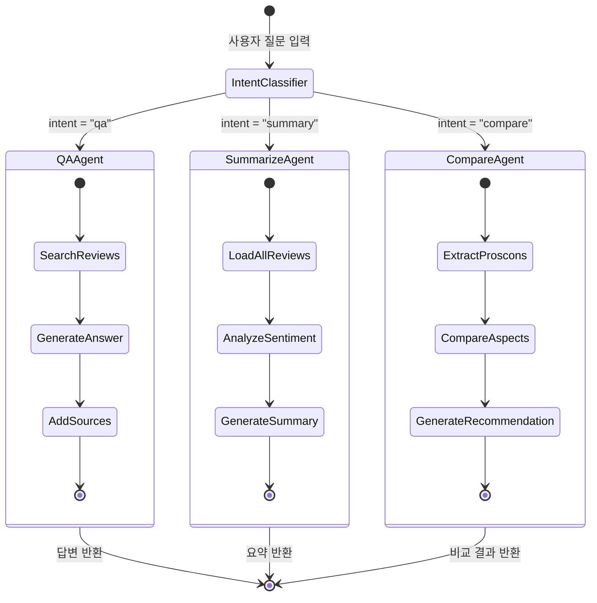
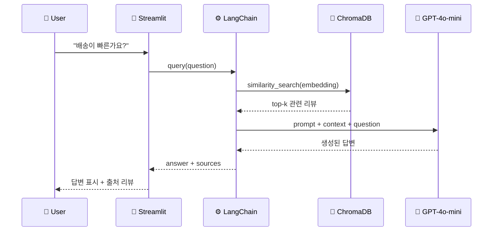
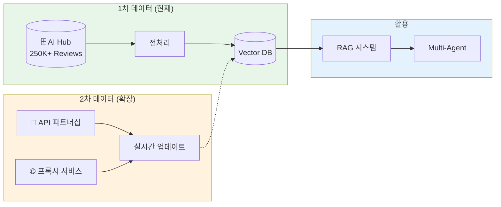
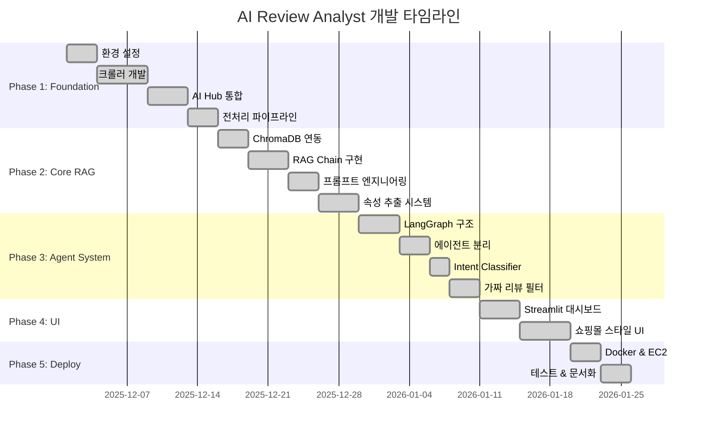

# [PRD] AI Review Analyst: Smart Buying Decision Agent

**부제: 비정형 리뷰 데이터를 활용한 이커머스 구매 의사결정 최적화 솔루션**

| **문서 버전**   | v1.1                  | **작성자**      | 안성재                                                       |
| --------------- | --------------------- | --------------- | ------------------------------------------------------------ |
| **상태**        | 개발 완료 (Phase 1-5) | **타겟 플랫폼** | Web (MVP), App Integration                                   |
| **최종 수정일** | 2026-01-14            | **GitHub**      | [Repository](https://github.com/sammy0329/ai-review-analyst) |

---

## 1. 프로젝트 요약 (Executive Summary)

> **"리뷰를 읽는 시간 30분을 30초로 단축시킨다."**

대다수의 이커머스 사용자는 구매 실패를 피하기 위해 수많은 리뷰를 탐색하지만, 방대한 양과 광고성 정보로 인해 피로감을 느낍니다. 본 프로젝트는 **RAG(검색 증강 생성)** 기술을 활용하여 상품 리뷰를 정량/정성적으로 분석하고, 사용자의 자연어 질문에 **팩트 기반(Fact-based)**으로 답변하여 구매 확신을 주는 AI 에이전트입니다.

---

## 2. 문제 정의 (Problem Statement)

올웨이즈와 같은 초저가/발견형 커머스에서 발생하는 사용자 경험(UX)의 병목 구간을 정의합니다.

### 2.1 정보 과부하 (Information Overload)

- 인기 상품의 경우 리뷰가 수천 개에 달함
- 유의미한 정보를 찾기 위해 스크롤을 끊임없이 내려야 하는 피로감

### 2.2 신뢰도 이슈 (Trust Issues)

- "진짜 좋은 건가?" vs "바이럴 마케팅인가?" 구분의 어려움
- 구매 결정을 미루거나 포기하는 이탈 발생

### 2.3 맥락 부재 (Lack of Context)

- 별점 4.5점인 상품이라도 "매운 것을 못 먹는 나"에게 적합한지 알 수 없음
- 개인화된 정보 필터링의 부재

---

## 3. 프로젝트 목표 (Project Goals)

### 3.1 비즈니스 목표 (Business Goal)

- 사용자의 상품 탐색 및 검증 시간(Time-to-Decision)을 획기적으로 단축
- 구매 결정 단계에서의 이탈률 감소 및 전환율(CVR) 증대 기여

### 3.2 기술적 목표 (Technical Goal)

- **LLM Hallucination 최소화:** RAG 아키텍처를 통해 실제 리뷰 원문에 근거한 답변 생성
- **자율 에이전트 구현:** 사용자의 의도(단순 요약 vs 특정 질문 vs 비교)를 파악하여 동적으로 도구를 선택하는 Agent Flow 구현

---

## 4. 사용자 페르소나 (User Persona)

구체적인 타겟 유저를 설정하여 기능의 방향성을 잡습니다.

### 4.1 페르소나 A: "꼼꼼한 검증가" 지혜님 (20대 후반, 직장인)

> _"최저가도 좋지만 실패는 싫어요. 옷 재질이 싼티 나지는 않는지, 빨래하면 줄어드는지 꼼꼼히 보고 싶어요."_

| 항목           | 내용                                                           |
| -------------- | -------------------------------------------------------------- |
| **Needs**      | 광고를 거르고 실사용자의 단점 리뷰를 먼저 보고 싶어 함         |
| **Pain Point** | 리뷰 탭을 '최신순', '별점 낮은순'으로 필터링하며 시간을 낭비함 |
| **Goal**       | 빠르게 핵심 단점을 파악하고 구매 여부 결정                     |

### 4.2 페르소나 B: "가족 안전 제일" 민수님 (40대, 주부)

> _"아이 먹일 건데 좀 비싸도 안전한 게 중요해요. 성분이나 알러지 반응에 대한 얘기가 있는지 궁금해요."_

| 항목           | 내용                                                                |
| -------------- | ------------------------------------------------------------------- |
| **Needs**      | 본인의 특수한 상황(육아, 알러지 등)에 맞는 정보만 빠르게 필터링     |
| **Pain Point** | 수백 개의 리뷰 중 '아이', '알러지' 키워드가 들어간 리뷰를 찾기 힘듦 |
| **Goal**       | 안전성과 관련된 리뷰만 선별해서 확인                                |

---

## 5. 핵심 기능 상세 (Key Features)

### F1. 팩트 기반 리뷰 요약 (Fact-based Summarization)

**설명:** 전체 리뷰를 분석하여 긍정/부정 비율을 시각화하고, 주요 키워드(배송, 맛, 품질, 가성비)별로 3줄 요약 제공.

**기술적 차별점:**

- 단순히 "좋아요"라고 요약하는 것이 아닌, **수치화된 근거(Quantitative Evidence)** 제시
- 예: _"리뷰의 82%가 배송이 빠르다고 언급했습니다"_

**관련 기술:** `Prompt Engineering`, `Text Analytics`

---

### F2. 시맨틱 Q&A 챗봇 (RAG Chatbot)

**설명:** 사용자가 "이거 160cm인데 기장 괜찮을까?"라고 물으면, 비슷한 체형의 리뷰 데이터를 벡터 검색(Vector Search)하여 답변.

**기술적 차별점:**

- 답변 하단에 **[참고한 리뷰 원문 보기]** 링크를 제공
- 할루시네이션(거짓 정보)에 대한 불안감 해소

**관련 기술:** `RAG`, `Vector Database`, `Semantic Search`

---

### F3. 상품 비교 분석 (Comparison Agent)

**설명:** 두 개 이상의 상품 URL을 입력하면 가격, 스펙 외에 **"실사용자 경험 차이"**를 비교.

**시나리오 예시:**

- A상품: "맛있지만 배송이 느림"
- B상품: "맛은 평범하지만 로켓배송"
- → 사용자의 우선순위에 따라 추천

**관련 기술:** `Multi-Agent`, `Reasoning`, `LangGraph`

---

### F4. 가짜 리뷰 필터링 (Anti-Spam Filter)

**설명:** 지나치게 반복적인 문구, 모호한 칭찬만 있는 리뷰(어뷰징 의심)를 LLM이 식별하여 분석 데이터에서 제외하거나 가중치를 낮춤.

**관련 기술:** `Classification`, `Anomaly Detection`

---

### F5. LLM 기반 속성 추출 (Aspect Extraction)

**설명:** 라벨이 없는 Raw 리뷰 텍스트에서 LLM을 활용해 속성(Aspect)을 자동으로 추출하고, 각 속성에 대한 감정을 분석합니다.

**핵심 기능:**

- **속성 자동 추출:** 가격, 디자인, 사이즈, 품질, 배송 등 리뷰에 언급된 속성 식별
- **속성별 감정 분석:** 각 속성에 대한 긍정/부정/중립 판단
- **속성별 통계 시각화:** 차트를 통한 속성별 감정 분포 표시
- **제품 비교:** 동일 속성 기준으로 여러 제품 비교 분석

**시나리오 예시:**

```
입력: "가격은 좀 비싸지만 소재가 정말 좋아요. 배송도 빨랐습니다."

출력:
- 가격: 부정 (비싸다)
- 소재/품질: 긍정 (좋다)
- 배송: 긍정 (빠르다)
```

**프로덕션 활용:**

- 실제 이커머스 환경에서는 사전 라벨링된 데이터가 없음
- 이 기능으로 어떤 리뷰 데이터든 속성별 분석 가능
- 판매자/마케터가 제품의 강점/약점을 빠르게 파악

**관련 기술:** `LLM Prompting`, `Structured Output`, `Batch Processing`

---

### F6. 쇼핑몰 스타일 제품 탐색 (Product Explorer)

**설명:** 실제 쇼핑몰처럼 제품 목록 → 제품 상세 → 리뷰 분석/Q&A 형태의 직관적인 탐색 경험을 제공합니다.

**핵심 기능:**

- **제품 목록 페이지:** 카드 그리드 형태로 제품 표시, 평점/리뷰 수/감정 요약 한눈에 확인
- **카테고리 필터링:** 패션, 화장품, 가전, IT기기, 생활용품 선택
- **검색 및 정렬:** 제품명 검색, 리뷰 많은순/평점 높은순 정렬
- **페이지네이션:** 제품 목록 12개/페이지, 리뷰 목록 10개/페이지
- **제품 상세 페이지:** 요약, 속성 분석, Q&A, 리뷰 목록 4개 탭 구성
- **속성 분석 뷰:** 전체 리뷰 텍스트에서 속성 하이라이트 (감정별 색상), 감정 토글 필터
- **제품별 Q&A:** 해당 제품의 리뷰만으로 RAG 구성, 맥락 있는 질의응답

**UI 구조:**

```
제품 목록 (메인)
┌─────────┐ ┌─────────┐ ┌─────────┐
│ 제품 A  │ │ 제품 B  │ │ 제품 C  │
│ ⭐ 4.2  │ │ ⭐ 3.8  │ │ ⭐ 4.7  │
│ 리뷰 42 │ │ 리뷰 28 │ │ 리뷰 156│
│ 🟢 긍정 │ │ 🟡 보통 │ │ 🟢 긍정 │
└─────────┘ └─────────┘ └─────────┘
            ↓ 클릭
제품 상세
[📊 요약] [🏷️ 속성분석] [💬 Q&A] [📋 리뷰목록]
```

**기대 효과:**

- 사용자가 익숙한 쇼핑몰 UX로 진입 장벽 낮춤
- 제품 단위로 분석하여 더 구체적인 인사이트 제공
- "이 제품" 맥락에서 질문 가능하여 정확한 답변

**관련 기술:** `Streamlit`, `Session State`, `Data Grouping`, `RAG per Product`

---

## 6. 사용자 흐름 (User Flow)



---

## 7. 시스템 아키텍처 (System Architecture)



### 7.1 LangGraph Agent Flow



### 7.2 RAG Pipeline (Sequence)



---

## 7.3 데이터 소스 전략 (Data Source Strategy)

### 크롤링 한계점

주요 이커머스 플랫폼(쿠팡, 네이버쇼핑, 11번가 등)은 강력한 봇 탐지 시스템(Akamai 등)을 적용하여 자동화된 리뷰 수집이 제한됩니다.

| 플랫폼     | 상태           | 이슈                          |
| ---------- | -------------- | ----------------------------- |
| 쿠팡       | ❌ 차단        | Akamai 봇 탐지, Access Denied |
| 네이버쇼핑 | ❌ 차단        | IP 기반 접속 제한             |
| 11번가     | ❌ 차단        | JavaScript 렌더링 차단        |
| 올웨이즈   | ❌ 서비스 종료 | 도메인 판매 중                |

### 대안: 공개 데이터셋 활용

크롤링 한계를 극복하기 위해 **AI Hub 속성기반 감정분석 데이터**를 활용합니다.

| 항목           | 내용                                                                 |
| -------------- | -------------------------------------------------------------------- |
| **데이터셋명** | 속성기반 감정분석 데이터                                             |
| **출처**       | [AI Hub](https://aihub.or.kr/aihubdata/data/view.do?dataSetSn=71603) |
| **규모**       | 250,312건 (쇼핑몰 90% + SNS 10%)                                     |
| **카테고리**   | 패션, 화장품, 가전, IT기기, 생활용품                                 |
| **라벨**       | 속성별 감정 태깅 (배송, 품질, 가격 등)                               |
| **형식**       | JSON, TXT                                                            |
| **활용 목적**  | RAG 학습, 속성별 감성 분석, 상품 비교                                |

### 하이브리드 접근법



**기대 효과:**

- ✅ 대규모 이커머스 리뷰 데이터로 RAG 품질 향상
- ✅ 속성별 감정 태깅으로 세분화된 분석 가능
- ✅ 다양한 상품 카테고리(패션/화장품/가전/IT/생활용품) 지원
- ✅ 핵심 AI 기능 개발에 집중 가능

---

## 8. 기술 스택 (Tech Stack)

| Category          | Technology         | 선택 이유                             |
| ----------------- | ------------------ | ------------------------------------- |
| **Language**      | Python 3.9+        | AI/ML 생태계 지원, 빠른 프로토타이핑  |
| **LLM Framework** | LangChain          | Agent & Chain 관리, 풍부한 문서화     |
| **Flow Control**  | LangGraph          | 복잡한 의사결정 흐름 제어, State 관리 |
| **LLM Model**     | OpenAI GPT-4o-mini | 비용 효율성과 속도의 균형             |
| **Vector DB**     | ChromaDB           | 경량화, 로컬 개발 용이                |
| **Metadata DB**   | SQLite             | 가벼운 메타데이터 저장                |
| **Web Crawler**   | Playwright         | 동적 페이지(JS 렌더링) 대응           |
| **HTML Parser**   | BeautifulSoup4     | 간편한 DOM 파싱                       |
| **Frontend**      | Streamlit          | 빠른 MVP 프로토타이핑                 |
| **Deployment**    | Docker, AWS EC2    | Free Tier 활용 가능                   |

---

## 9. 기대 효과 및 검증 지표 (Metrics)

프로젝트 완료 후, 아래 지표를 측정하여 성과를 증명할 예정입니다.

| 지표                                 | 설명                                             | 목표                           |
| ------------------------------------ | ------------------------------------------------ | ------------------------------ |
| **탐색 시간 단축**                   | 테스트 그룹 대상 상품 판단에 걸리는 시간 측정    | 기존 대비 **70% 단축**         |
| **질문 해결률 (Retrieval Accuracy)** | 사용자 질문에 올바른 리뷰 문맥을 가져왔는지 평가 | Top-k Accuracy **90% 이상**    |
| **시스템 응답 속도 (Latency)**       | URL 입력 후 분석 완료까지 걸리는 시간            | **10초 이내** (Streaming 적용) |
| **사용자 만족도**                    | MVP 테스트 후 설문 조사                          | NPS **8점 이상** (10점 만점)   |

---

## 10. 개발 로드맵 (Development Roadmap)



### Phase 1: Foundation ✅ (100% 완료)

- [x] 프로젝트 환경 설정 (Python, Dependencies)
- [x] Playwright 기반 크롤러 개발 (봇 탐지로 제한적)
- [x] AI Hub 공개 데이터셋 통합 (250K+ 이커머스 리뷰)
- [x] 리뷰 데이터 전처리 파이프라인 구축

### Phase 2: Core RAG ✅ (100% 완료)

- [x] ChromaDB 연동 및 임베딩 파이프라인
- [x] LangChain 기반 RAG 체인 구현
- [x] 프롬프트 엔지니어링 (Q&A, 요약, 비교, 감성분석)
- [x] LLM 기반 속성 추출 시스템 (27개 테스트 통과)

### Phase 3: Agent System ✅ (100% 완료)

- [x] LangGraph 기반 멀티 에이전트 구조
- [x] 요약 / Q&A / 비교 에이전트 분리
- [x] Agent Router (Intent Classifier) 구현
- [x] 가짜 리뷰 필터링 시스템

### Phase 4: UI & Polish ✅ (100% 완료)

- [x] Streamlit 대시보드 개발 (기본 UI)
- [x] 쇼핑몰 스타일 UI 개편 (제품 목록 → 상세 → Q&A)
- [x] 카테고리 대분류/소분류 계층 필터
- [x] 제품별 RAG Q&A 기능

### Phase 5: Deployment ✅ (100% 완료)

- [x] Docker 컨테이너화
- [x] AWS EC2 배포
- [x] 테스트 커버리지 44% 달성 (256개 테스트)

---

## 11. 리스크 및 대응 방안

| 리스크                 | 영향도 | 대응 방안                                                   | 현재 상태 |
| ---------------------- | ------ | ----------------------------------------------------------- | --------- |
| **크롤링 차단**        | High   | 공개 데이터셋(AI Hub) 활용으로 전환, 향후 API 파트너십 고려 | 🔄 진행중 |
| **API 비용 증가**      | Medium | GPT-4o-mini 사용, 캐싱 전략, 토큰 최적화                    | 🔄 진행중 |
| **Hallucination**      | High   | RAG 아키텍처 필수 적용, 출처 명시, 검증 로직 추가           | 🔄 진행중 |
| **응답 지연**          | Medium | Streaming 적용, 비동기 처리, 캐싱                           | ⏳ 대기   |
| **데이터 다양성 부족** | Low    | AI Hub 데이터셋이 5개 카테고리 지원으로 해결                | ✅ 해결   |

---

## 12. 참고 자료

- [LangChain Documentation](https://python.langchain.com/docs/)
- [LangGraph Documentation](https://langchain-ai.github.io/langgraph/)
- [ChromaDB Documentation](https://docs.trychroma.com/)
- [Playwright Documentation](https://playwright.dev/python/)
- [Streamlit Documentation](https://docs.streamlit.io/)

---

_본 문서는 프로젝트 진행에 따라 지속적으로 업데이트됩니다._
