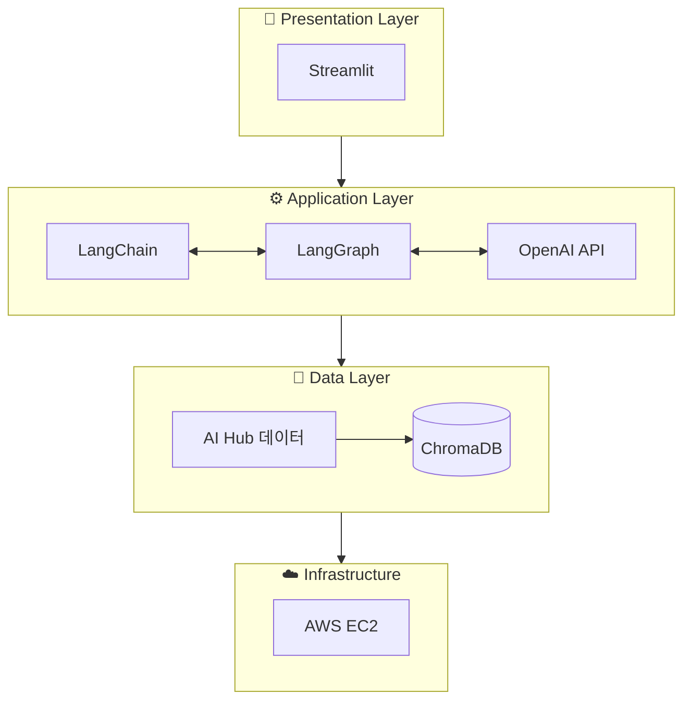
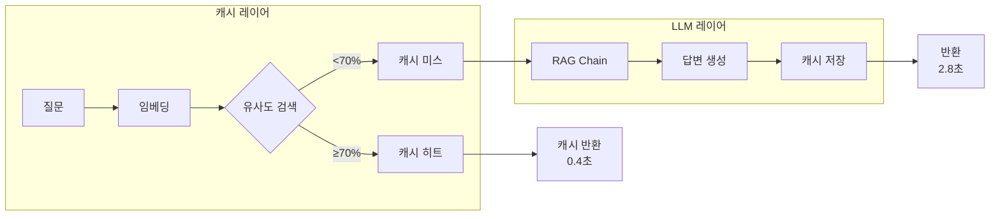

# Tech Stack Documentation

> AI Review Analyst 프로젝트에서 사용하는 기술 스택 상세 문서

---

## Overview



---

## 1. Core Language

### Python 3.9+

| 항목 | 내용 |
|------|------|
| **버전** | 3.9 이상 (권장: 3.11) |
| **선택 이유** | AI/ML 생태계 지원, 풍부한 라이브러리, 빠른 프로토타이핑 |
| **공식 문서** | https://docs.python.org/3/ |

**주요 사용 라이브러리:**
```
python-dotenv    # 환경 변수 관리
pydantic         # 데이터 검증 및 설정 관리
asyncio          # 비동기 처리
typing           # 타입 힌팅
```

---

## 2. LLM Framework

### 2.1 LangChain

| 항목 | 내용 |
|------|------|
| **버전** | 0.3.x (최신 안정 버전) |
| **역할** | LLM 애플리케이션 오케스트레이션 프레임워크 |
| **선택 이유** | Chain/Agent 추상화, 풍부한 통합 생태계, 활발한 커뮤니티 |
| **공식 문서** | https://python.langchain.com/docs/ |

**프로젝트 내 활용:**
```python
# RAG Chain 구성 예시
from langchain.chains import RetrievalQA
from langchain_openai import ChatOpenAI
from langchain_chroma import Chroma

llm = ChatOpenAI(model="gpt-4o-mini", temperature=0)
retriever = Chroma(collection_name="reviews").as_retriever()

qa_chain = RetrievalQA.from_chain_type(
    llm=llm,
    chain_type="stuff",
    retriever=retriever,
    return_source_documents=True  # 출처 표기를 위한 원문 반환
)
```

**핵심 모듈:**
| 모듈 | 용도 |
|------|------|
| `langchain-core` | 기본 추상화 (Runnable, Chain) |
| `langchain-openai` | OpenAI 모델 통합 |
| `langchain-chroma` | ChromaDB 벡터스토어 통합 |
| `langchain-community` | 커뮤니티 통합 (Playwright 등) |

---

### 2.2 LangGraph

| 항목 | 내용 |
|------|------|
| **버전** | 0.2.x (최신) |
| **역할** | 복잡한 에이전트 워크플로우 제어 |
| **선택 이유** | 상태 기반 그래프 구조, 조건부 라우팅, 순환 처리 가능 |
| **공식 문서** | https://langchain-ai.github.io/langgraph/ |

**프로젝트 내 활용:**
```python
# Multi-Agent 라우팅 예시
from langgraph.graph import StateGraph, END
from typing import TypedDict, Literal

class AgentState(TypedDict):
    query: str
    intent: Literal["summarize", "qa"]
    response: str

def router(state: AgentState) -> str:
    """사용자 의도에 따라 적절한 에이전트로 라우팅"""
    intent = state["intent"]
    if intent == "summarize":
        return "summarize_agent"
    else:
        return "qa_agent"

# 그래프 구성
workflow = StateGraph(AgentState)
workflow.add_node("classifier", classify_intent)
workflow.add_node("summarize_agent", summarize_reviews)
workflow.add_node("qa_agent", answer_question)

workflow.add_conditional_edges("classifier", router)
workflow.set_entry_point("classifier")
```

**LangGraph vs LangChain Agent:**
| 비교 항목 | LangChain Agent | LangGraph |
|-----------|-----------------|-----------|
| 구조 | 단일 루프 | 그래프 기반 |
| 상태 관리 | 제한적 | 명시적 State 정의 |
| 조건 분기 | Tool 선택 의존 | 명시적 Edge 정의 |
| 적합한 경우 | 단순 도구 호출 | 복잡한 멀티스텝 워크플로우 |

---

## 3. AI Model

### OpenAI GPT-4o-mini

| 항목 | 내용 |
|------|------|
| **모델명** | gpt-4o-mini |
| **선택 이유** | 비용 효율성 + 충분한 성능 (GPT-4 대비 약 10배 저렴) |
| **토큰 제한** | 입력 128K, 출력 16K |
| **공식 문서** | https://platform.openai.com/docs/models |

**비용 비교:**
| 모델 | Input (1M tokens) | Output (1M tokens) |
|------|-------------------|-------------------|
| GPT-4o | $5.00 | $15.00 |
| **GPT-4o-mini** | **$0.15** | **$0.60** |
| GPT-3.5 Turbo | $0.50 | $1.50 |

**프로젝트 내 활용:**
```python
from langchain_openai import ChatOpenAI

# 메인 LLM 설정
llm = ChatOpenAI(
    model="gpt-4o-mini",
    temperature=0,        # 일관된 출력을 위해 0 설정
    max_tokens=2048,
    streaming=True        # UX 향상을 위한 스트리밍
)

# 임베딩 모델 (별도)
from langchain_openai import OpenAIEmbeddings
embeddings = OpenAIEmbeddings(model="text-embedding-3-small")
```

**임베딩 모델 선택:**
| 모델 | 차원 | 비용 (1M tokens) | 특징 |
|------|------|------------------|------|
| text-embedding-3-small | 1536 | $0.02 | 경량, 빠름 |
| text-embedding-3-large | 3072 | $0.13 | 고성능, 정확 |

→ MVP 단계에서는 **text-embedding-3-small** 사용 권장

---

## 4. Vector Database

### 벡터 DB란?

**벡터 DB (Vector Database)**는 텍스트를 숫자 벡터로 변환해서 저장하고, **의미 기반 검색**을 가능하게 하는 데이터베이스입니다.

**일반 DB vs 벡터 DB:**
| | 일반 DB | 벡터 DB |
|---|---|---|
| 저장 | 텍스트 그대로 | 텍스트 → 숫자 벡터 (임베딩) |
| 검색 | 키워드 일치 | 의미 유사도 |
| 예시 | "배송" 검색 → "배송" 포함된 것만 | "배송 빠른가요?" → "주문 다음날 도착" 찾음 |

**작동 원리:**
```
1. 저장 시
   "배송이 정말 빨라서 놀랐어요"
        ↓ OpenAI 임베딩 (text-embedding-3-small)
   [0.12, -0.45, 0.78, ...] (1536차원 벡터)
        ↓
   ChromaDB에 저장

2. 검색 시
   "배송이 빠른가요?"
        ↓ 임베딩
   [0.11, -0.42, 0.80, ...]
        ↓ 코사인 유사도 계산
   가장 가까운 벡터 = "배송이 정말 빨라서 놀랐어요"
```

**왜 필요한가?**
RAG (검색 증강 생성)에서 사용자 질문과 **의미적으로 관련된** 리뷰를 찾아서 LLM에게 전달하기 위해 필수입니다.

---

### ChromaDB

| 항목 | 내용 |
|------|------|
| **버전** | 0.5.x |
| **역할** | 리뷰 텍스트 임베딩 저장 및 시맨틱 검색 |
| **선택 이유** | 로컬 개발 용이, 설치 간편, Python 네이티브 |
| **공식 문서** | https://docs.trychroma.com/ |

**vs 다른 Vector DB:**
| DB | 장점 | 단점 | 적합한 경우 |
|----|------|------|-------------|
| **ChromaDB** | 설치 간편, 로컬 개발 | 대용량 한계 | MVP, 프로토타입 |
| Pinecone | 관리형, 확장성 | 비용 발생 | 프로덕션 |
| Weaviate | 기능 풍부 | 러닝커브 | 복잡한 요구사항 |
| FAISS | 고성능 | 관리 필요 | 대용량 검색 |

**프로젝트 내 활용:**
```python
import chromadb
from langchain_chroma import Chroma
from langchain_openai import OpenAIEmbeddings

# ChromaDB 클라이언트 설정
client = chromadb.PersistentClient(path="./data/chroma_db")

# LangChain 통합
vectorstore = Chroma(
    client=client,
    collection_name="product_reviews",
    embedding_function=OpenAIEmbeddings(model="text-embedding-3-small")
)

# 리뷰 저장
vectorstore.add_texts(
    texts=["맛있어요! 배송도 빨랐습니다.", "포장이 조금 아쉬웠어요"],
    metadatas=[
        {"product_id": "123", "rating": 5, "date": "2024-01-10"},
        {"product_id": "123", "rating": 3, "date": "2024-01-09"}
    ]
)

# 시맨틱 검색
results = vectorstore.similarity_search(
    query="배송이 빠른가요?",
    k=5  # 상위 5개 결과
)
```

---

### SQLite

| 항목 | 내용 |
|------|------|
| **역할** | 제품/리뷰 메타데이터 저장 |
| **선택 이유** | 경량, 별도 서버 불필요, Python 내장 |
| **저장 위치** | `data/reviews.db` |

**프로젝트 내 활용:**
```python
from src.database import get_all_products, get_reviews_by_product

# 제품 목록 조회
products = get_all_products()

# 제품별 리뷰 조회
reviews = get_reviews_by_product("제품명")

# 리뷰 날짜 임의화 (실제 서비스 느낌)
from src.database import randomize_review_dates
randomize_review_dates(start_days_ago=365)  # 최근 1년 내 임의 날짜
```

**테이블 구조:**
| 테이블 | 컬럼 | 설명 |
|--------|------|------|
| products | id, name, category, avg_rating, review_count | 제품 정보 |
| reviews | id, product_id, text, sentiment, aspects, rating, created_at | 리뷰 데이터 |
| qa_feedbacks | id, product_name, question, answer, feedback, created_at | Q&A 피드백 (Phase 8) |
| qa_logs | id, product_name, question, response_time_ms, created_at | Q&A 사용 로그 (Phase 8) |

---

### 시맨틱 캐싱 (Phase 8)

| 항목 | 내용 |
|------|------|
| **역할** | 유사 질문 캐싱으로 API 비용 절감 및 응답 속도 향상 |
| **저장소** | ChromaDB `qa_cache` 컬렉션 |
| **유사도 임계값** | 70% (cosine similarity) |
| **TTL** | 7일 |

**프로젝트 내 활용:**
```python
from src.pipeline.semantic_cache import SemanticCache

cache = SemanticCache()

# 캐시 조회
cached = cache.lookup(product_name="제품A", question="배송 빠른가요?")
if cached:
    return cached["answer"]  # 캐시 히트 (0.1초)

# 캐시 미스 → LLM 호출 후 저장
answer = rag_chain.query(question)
cache.store(product_name="제품A", question="배송 빠른가요?", answer=answer)
```

**실측 성능 (GPT-4o-mini, 5회 평균):**

| 구분 | 응답 시간 | 비고 |
|------|-----------|------|
| 캐시 미스 (LLM 호출) | **2.8초** | 임베딩 + LLM API |
| 캐시 히트 | **0.4초** | 임베딩만 (LLM 호출 없음) |
| **개선율** | **85% 단축** | (2.8-0.4)/2.8 |

---

## 5. Web Crawling

### 5.1 Playwright

| 항목 | 내용 |
|------|------|
| **버전** | 1.40.x |
| **역할** | 동적 웹페이지(JS 렌더링) 리뷰 크롤링 |
| **선택 이유** | Headless 브라우저, 안정적인 자동화, 다양한 브라우저 지원 |
| **공식 문서** | https://playwright.dev/python/ |

**vs 다른 크롤링 도구:**
| 도구 | JS 렌더링 | 속도 | 적합한 경우 |
|------|-----------|------|-------------|
| **Playwright** | O | 중간 | 동적 SPA |
| Selenium | O | 느림 | 레거시 지원 |
| Requests | X | 빠름 | 정적 페이지 |
| Scrapy | X | 빠름 | 대용량 크롤링 |

**프로젝트 내 활용:**
```python
from playwright.async_api import async_playwright

async def crawl_reviews(url: str) -> list[dict]:
    async with async_playwright() as p:
        browser = await p.chromium.launch(headless=True)
        page = await browser.new_page()

        # User-Agent 설정 (차단 우회)
        await page.set_extra_http_headers({
            "User-Agent": "Mozilla/5.0 (Windows NT 10.0; Win64; x64) ..."
        })

        await page.goto(url)

        # 리뷰 영역이 로드될 때까지 대기
        await page.wait_for_selector(".review-item", timeout=10000)

        # 무한 스크롤 처리
        for _ in range(10):
            await page.evaluate("window.scrollTo(0, document.body.scrollHeight)")
            await page.wait_for_timeout(1000)

        # 리뷰 데이터 추출
        reviews = await page.evaluate("""
            () => Array.from(document.querySelectorAll('.review-item')).map(el => ({
                text: el.querySelector('.review-text')?.innerText,
                rating: el.querySelector('.rating')?.getAttribute('data-score'),
                date: el.querySelector('.date')?.innerText
            }))
        """)

        await browser.close()
        return reviews
```

---

### 5.2 BeautifulSoup4

| 항목 | 내용 |
|------|------|
| **버전** | 4.12.x |
| **역할** | HTML 파싱 및 데이터 추출 |
| **선택 이유** | 직관적인 API, 유연한 파서 선택 |
| **공식 문서** | https://www.crummy.com/software/BeautifulSoup/bs4/doc/ |

**프로젝트 내 활용:**
```python
from bs4 import BeautifulSoup

def parse_review_html(html: str) -> dict:
    soup = BeautifulSoup(html, 'lxml')

    return {
        "title": soup.select_one("h1.product-title").get_text(strip=True),
        "price": soup.select_one(".price").get_text(strip=True),
        "reviews": [
            {
                "text": review.select_one(".text").get_text(strip=True),
                "rating": int(review.get("data-rating", 0))
            }
            for review in soup.select(".review-item")
        ]
    }
```

---

## 6. Frontend

### Streamlit

| 항목 | 내용 |
|------|------|
| **버전** | 1.30.x |
| **역할** | MVP 웹 대시보드 UI |
| **선택 이유** | Python 전용, 빠른 프로토타이핑, 데이터 시각화 내장 |
| **공식 문서** | https://docs.streamlit.io/ |

**프로젝트 내 활용:**
```python
import streamlit as st

st.set_page_config(page_title="AI Review Analyst", layout="wide")

st.title("AI Review Analyst")
st.markdown("리뷰를 읽는 시간 30분을 30초로 단축하다.")

# URL 입력
url = st.text_input("분석할 상품 URL을 입력하세요")

if st.button("분석 시작"):
    with st.spinner("리뷰를 분석하고 있습니다..."):
        # 크롤링 및 분석 로직
        result = analyze_reviews(url)

    # 결과 표시
    col1, col2 = st.columns(2)
    with col1:
        st.metric("긍정 리뷰", f"{result['positive_ratio']}%")
    with col2:
        st.metric("부정 리뷰", f"{result['negative_ratio']}%")

    # 차트
    st.bar_chart(result['keyword_stats'])

# 채팅 인터페이스
if "messages" not in st.session_state:
    st.session_state.messages = []

for msg in st.session_state.messages:
    with st.chat_message(msg["role"]):
        st.markdown(msg["content"])

if prompt := st.chat_input("리뷰에 대해 질문하세요"):
    st.session_state.messages.append({"role": "user", "content": prompt})

    # LLM 응답 (Streaming)
    with st.chat_message("assistant"):
        response = st.write_stream(get_ai_response(prompt))
    st.session_state.messages.append({"role": "assistant", "content": response})
```

---

## 7. Deployment

### AWS EC2 (Free Tier)

| 항목 | 내용 |
|------|------|
| **인스턴스** | t2.micro (1 vCPU, 1GB RAM) |
| **스토리지** | 30GB EBS (Free Tier) |
| **비용** | 월 750시간 무료 (1년) |

**실행 방법:**
```bash
# EC2에서 직접 실행
cd ~/ai-review-analyst
source venv/bin/activate
streamlit run src/ui/app.py --server.port=8501 --server.address=0.0.0.0
```

---

## 8. Dependencies Summary

### requirements.txt
```
# Core
python-dotenv==1.0.1         # 환경 변수 관리
pydantic==2.10.4             # 데이터 검증
pydantic-settings==2.7.1     # 설정 관리

# LLM Framework
langchain==0.3.14            # LLM 오케스트레이션
langchain-openai==0.3.0      # OpenAI 통합
langchain-chroma==0.2.0      # ChromaDB 통합
langchain-community==0.3.14  # 커뮤니티 통합
langgraph==0.2.60            # 에이전트 워크플로우

# Vector DB
chromadb==0.5.23             # 벡터 데이터베이스

# Web Crawling (크롤러 테스트용)
playwright==1.49.1           # 동적 웹페이지 크롤링
playwright-stealth==1.0.6    # 봇 탐지 우회
beautifulsoup4==4.12.3       # HTML 파싱
lxml==5.3.0                  # XML/HTML 파서

# Frontend
streamlit==1.41.1            # 웹 대시보드 UI

# Utilities
tenacity==9.0.0              # 재시도 로직
tiktoken==0.8.0              # 토큰 카운팅
httpx==0.28.1                # HTTP 클라이언트
datasets==3.2.0              # HuggingFace 데이터셋

# Development
pytest==8.3.4                # 테스트 프레임워크
pytest-cov==6.0.0            # 테스트 커버리지
pytest-asyncio==0.25.2       # 비동기 테스트
```

---

## 9. 기술 스택 선택 근거 요약

| 레이어 | 선택 기술 | 핵심 선택 이유 |
|--------|-----------|----------------|
| **Language** | Python 3.11 | AI/ML 생태계, 생산성 |
| **LLM Orchestration** | LangChain + LangGraph | 유연한 체인 구성 + 상태 기반 에이전트 |
| **AI Model** | GPT-4o-mini | 비용 효율성 (GPT-4 대비 10배 저렴) |
| **Vector DB** | ChromaDB | 로컬 개발 용이, 설치 간편, 시맨틱 캐싱 |
| **Metadata DB** | SQLite | 제품/리뷰 메타데이터, 피드백/로그 저장 |
| **Data Source** | AI Hub | 180K+ 이커머스 리뷰 공개 데이터셋 |
| **Frontend** | Streamlit | 빠른 MVP 개발 |
| **Deployment** | AWS EC2 | Free Tier로 비용 최소화 |

---

## 10. Phase 8 최적화 기술 (Optimization)

### 10.1 시맨틱 캐싱 아키텍처



### 10.2 쿼리 확장 (Query Expansion)

검색 품질 향상을 위해 형식적인 표현을 자연스러운 표현으로 변환합니다.

| 원본 쿼리 | 확장된 쿼리 | 효과 |
|-----------|-------------|------|
| "장점은 무엇인가요?" | "좋은 점이 뭐예요?" | 유사도 0.179 → 0.246 |
| "단점은 무엇인가요?" | "아쉬운 점이 뭐예요?" | 부정 리뷰 검색 정확도 향상 |

```python
def _expand_query(self, question: str) -> str:
    """쿼리 확장: 딱딱한 표현을 자연스러운 표현으로 변환."""
    if "장점" in question:
        return question.replace("장점", "좋은 점")
    if "단점" in question:
        return question.replace("단점", "아쉬운 점")
    return question
```

### 10.3 검색 임계값 최적화

| 설정 | 이전 | 이후 | 효과 |
|------|------|------|------|
| `top_k` | 5 | 10 | 더 많은 컨텍스트 제공 |
| `min_score` | 0.3 | 0.1 | 관련 리뷰 누락 방지 |
| `min_results` | - | 3 | 최소 결과 보장 |

---

## 참고 자료

- [LangChain Documentation](https://python.langchain.com/docs/)
- [LangGraph Documentation](https://langchain-ai.github.io/langgraph/)
- [OpenAI API Reference](https://platform.openai.com/docs/api-reference)
- [ChromaDB Documentation](https://docs.trychroma.com/)
- [Playwright Python](https://playwright.dev/python/)
- [Streamlit Documentation](https://docs.streamlit.io/)

---

*본 문서는 프로젝트 진행에 따라 업데이트됩니다.*
